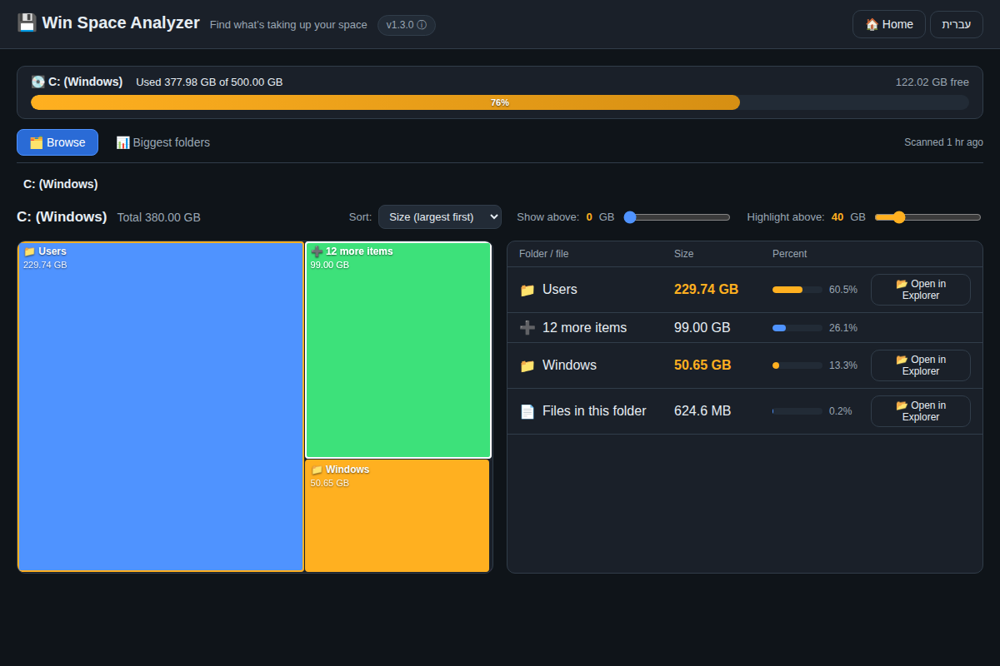

<div align="center">


# Win Space Analyzer

### 💾 Instantly see what's eating your disk space on Windows 11

A fast disk-space scanner with a visual treemap, installed with a single command. English & Hebrew UI.

<br />

[](https://github.com/matanlevanon/win-space-analyzer/releases/latest)
[](https://github.com/matanlevanon/win-space-analyzer/releases)
[](LICENSE)
[](https://github.com/matanlevanon/win-space-analyzer/releases/latest)

**[⬇️ Download for Windows](https://github.com/matanlevanon/win-space-analyzer/releases/latest) · [🌐 Website](https://matanlevanon.github.io/win-space-analyzer/) · [📦 Source code](https://github.com/matanlevanon/win-space-analyzer)**

<br />



</div>

<br />

<div align="center">

## ⚡ One-command install

Open **PowerShell** and paste:

</div>

```powershell
irm https://raw.githubusercontent.com/matanlevanon/win-space-analyzer/main/install.ps1 | iex
```

<div align="center">

The command downloads the latest release and launches the installer automatically.
<br />
Prefer a regular install? Download the **[Setup file](https://github.com/matanlevanon/win-space-analyzer/releases/latest)** and run it like any app.

> ⚠️ The app isn't digitally signed yet, so Windows SmartScreen sometimes warns on first run.
> Click **"More info" → "Run anyway"**. The code is fully open and auditable right here.

</div>

<br />

<div align="center">

## ✨ Features

</div>

<table align="center">
<tr>
<td width="33%" valign="top" align="center">

### ⚡ Fast scanning
A parallel robocopy-based engine scans a full drive in ~30 seconds - about 3.5× faster than a regular scan.

</td>
<td width="33%" valign="top" align="center">

### 🗂️ Visual treemap
Every folder is a tile sized by weight - spot the big ones at a glance, click to drill in.

</td>
<td width="33%" valign="top" align="center">

### 📊 Biggest folders
A flat list of the heaviest folders across the whole drive, with one-click jump.

</td>
</tr>
<tr>
<td width="33%" valign="top" align="center">

### 📈 Compare with previous scan
See exactly what grew, what freed up, and what's new since last time.

</td>
<td width="33%" valign="top" align="center">

### 💾 Saved scans
Every drive remembers its last scan - jump back to the results instantly, no rescan.

</td>
<td width="33%" valign="top" align="center">

### 🛡️ Completely safe
The app **deletes nothing** - it only finds and shows. "Open in Explorer" on every item. Deleting stays in your hands.

</td>
</tr>
</table>

<br />

<div align="center">

## 🌍 Bilingual

The UI ships in **English and Hebrew (עברית)** with full RTL support - switch languages any time with one click in the header. Your choice is remembered.

<br />

## 🚀 How it works

**1.** Install with one command &nbsp;·&nbsp; **2.** Scan a drive (~30 seconds) &nbsp;·&nbsp; **3.** Spot the heavy folder and hit "Open in Explorer" to delete it yourself

<br />

## 🛠️ Develop & run from source

</div>

Requires [Node.js](https://nodejs.org/) 18+.

```bash
git clone https://github.com/matanlevanon/win-space-analyzer.git
cd win-space-analyzer
npm install
npm start          # run in development
npm run build      # build Setup.exe + portable into dist/
```

<div align="center">

**Under the hood:** Electron · a `robocopy /MT`-based scan engine in a separate worker · a self-contained treemap (squarified algorithm) with zero external dependencies.

<br />

Want the details? See the [changelog](CHANGELOG.md).

<br />

Built for Windows 11 · Open source under the [MIT](LICENSE) license

Based on [disk-space-analyzer](https://github.com/MatanCH2020/disk-space-analyzer) by MatanCH2020 (MIT), extended with a bilingual UI, a persistent volume usage bar, and more.

</div>
